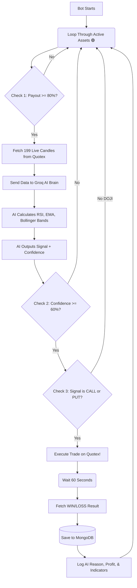

# Quotex AI Bot: The "Big Picture" Trading Workflow

This diagram illustrates exactly what happens behind the scenes every single minute when the bot is turned ON.

---

### Step-by-Step Breakdown

1. **The Patrol (The Loop):** 
   The bot continuously cycles through the specific assets you toggled `ON` (like `AUDNZD_otc`, `USDEGP_otc`).

2. **The Safety Check:** 
   Before even looking at the chart, it asks Quotex: *"Is this pair currently paying at least 80%?"* If the payout is garbage (like 60%), it instantly skips it so you don't risk $1 just to win $0.60.

3. **Data Harvesting:** 
   It connects directly to the Quotex websocket and downloads the last **199 1-minute candles** (Open, High, Low, Close data).

4. **The AI Brain (Groq/Llama 3):** 
   It feeds those 199 candles to the massive Llama 3 supercomputer. The AI rapidly calculates:
   * **Trend:** (Are we above or below the EMA 50 line?)
   * **Momentum:** (Is the RSI overbought or oversold?)
   * **Volatility:** (Is price bouncing off the Bollinger Bands?)
   * **Candlestick Patterns:** (Are there bullish/bearish engulfing shapes?)

5. **The Decision Filter:** 
   The AI gives a grade. If it is only 55% sure, it returns `doji` (wait), and the bot skips the trade. If it is **60% or higher**, the bot arms the trigger.

6. **Execution & Memory:** 
   The bot pulls the trigger, waits exactly 60 seconds, and checks if it won or lost. It then takes the result, the profit amount, and the **AI's exact logic** and locks it into your MongoDB database. This creates the "Memory" we need to eventually train our own model!
